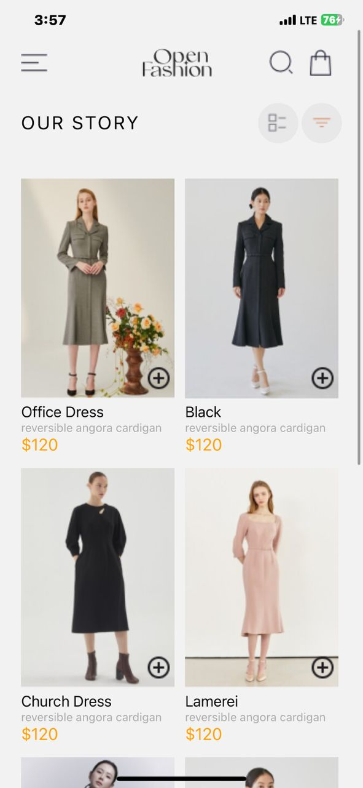
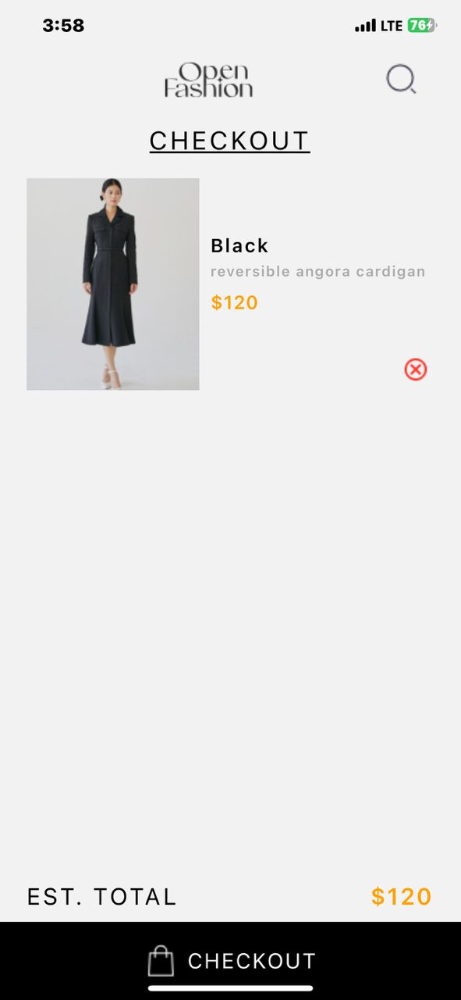
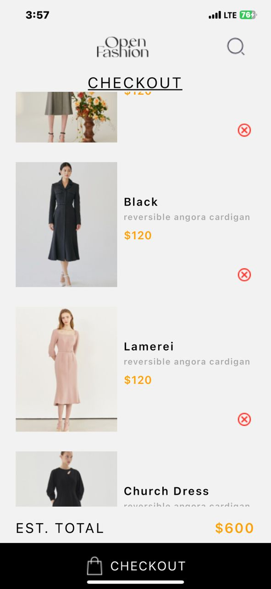

# rn-assignment6-11333063

## Project Overview

This project is a mobile application that allows users to view and manage a list of products. Users can add products to their cart, view the items in their cart, and remove products from their cart. The app is designed following the provided UI mockup.

## Components

### HomeScreen
- Displays a list of available products.
- Each product has an "Add to cart" button.

### CartScreen
- Displays the selected items.
- Each item has a "Remove from cart" button.

## Local Storage
The application uses local storage AsyncStorage to store the selected items locally on the device.

## Functionality
- View Products: Users can view a list of available products.
- Add to Cart: Users can add products to their cart.
- Remove from Cart: Users can remove products from their cart.
- View Cart: Users can view the items in their cart.

## Implementation Details

### Design Choices
- The UI is designed to be user-friendly adhering to the provided UI mockup.

### Data Storage
- Local storage is implemented using AsyncStorage to store the selected items on the user's device. This ensures that the cart contents are retained even if the app is closed or the device is restarted.

### Screenshots

